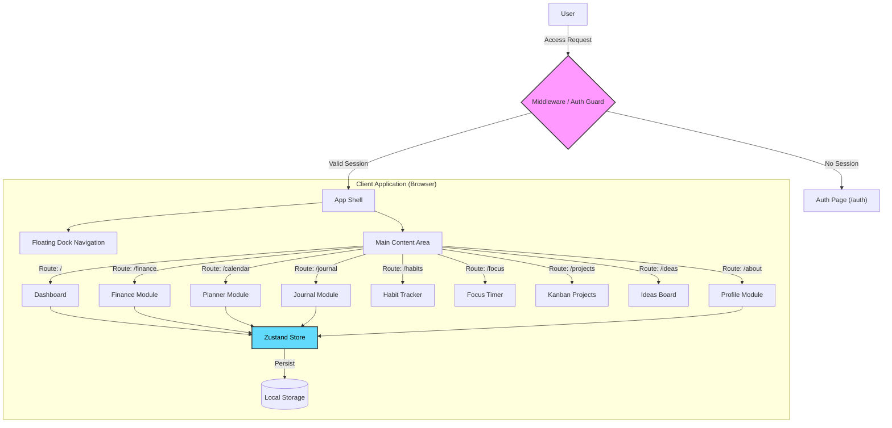

# LifeOS - Personal Life Operating System

LifeOS is a comprehensive, modern personal management web application designed to help users organize their life, finances, and mental well-being in one unified interface. Built with performance and aesthetics in mind, it features a glassmorphic design, smooth animations, and a seamless user experience.

 *Note: Replace with actual screenshot*

## 🚀 Key Features

*   **🛡️ Secure Authentication**: Middleware-protected routes with a custom login/signup interface.
*   **📊 Interactive Dashboard**: At-a-glance view of daily stats, quotes, and quick actions.
*   **💰 Finance Tracker**: Manage expenses, visualize spending with charts, and track budgets.
*   **📅 AI Planner**: Integrated calendar system for event management and scheduling.
*   **📔 Mindful Journal**: Daily journaling with mood tracking (emoji-based) and reflection.
*   **✅ Habit Tracker**: Visualize consistency with contribution graphs and streak tracking.
*   **⏲️ Focus Timer**: Pomodoro-style timer with customizable work/break intervals.
*   **📋 Kanban Projects**: Drag-and-drop project management with tasks, comments, and color coding.
*   **💡 Ideas Board**: Sticky-note style "Brain Dump" area for quick thoughts.
*   **📱 Mobile & PWA**: Fully offline-capable Progressive Web App with install support.
*   **🔔 Smart Notifications**: Local reminders to keep up with habits and journaling.
*   **🧩 Custom Dashboard**: Draggable widgets to personalize your home screen layout.
*   **Identity Hub**: Beautifully designed "About Me" profile page.
*   **🎨 Premium UI**:
    *   **Glassmorphism**: Modern, frosted-glass aesthetic using backdrop filters.
    *   **Floating Dock**: macOS-style detached navigation bar.
    *   **Animations**: Smooth transitions powered by `framer-motion`.

## 🛠️ Technology Stack

*   **Framework**: [Next.js 16](https://nextjs.org/) (App Router)
*   **Language**: [TypeScript](https://www.typescriptlang.org/)
*   **Styling**: 
    *   [Tailwind CSS v4](https://tailwindcss.com/)
    *   [Shadcn/UI](https://ui.shadcn.com/) (Component Library)
*   **Animations**: [Framer Motion](https://www.framer.com/motion/)
*   **State Management**: [Zustand](https://github.com/pmndrs/zustand)
*   **Charts**: [Recharts](https://recharts.org/)
*   **Calendar**: [React Big Calendar](https://github.com/jquense/react-big-calendar)
*   **Icons**: [Lucide React](https://lucide.dev/)

## 🏗️ Architecture

LifeOS follows a client-side heavy architecture for interactivity, hosted within the robust Next.js server environment.



## 📂 Project Structure

```bash
lifeos/
├── src/
│   ├── app/                 # Next.js App Router pages
│   │   ├── auth/            # Authentication page
│   │   ├── finance/         # Finance tracker
│   │   ├── journal/         # Journaling app
│   │   ├── habits/          # Habit tracker
│   │   ├── focus/           # Pomodoro timer
│   │   ├── projects/        # Kanban board
│   │   ├── ideas/           # Brain dump page
│   │   ├── about/           # Profile page
│   │   ├── globals.css      # Global styles & Tailwind
│   │   ├── layout.tsx       # Root layout & providers
│   │   └── page.tsx         # Dashboard Entry
│   ├── components/          # React Components
│   │   ├── ui/              # Reusable Shadcn UI components
│   │   ├── dashboard/       # Dashboard widgets
│   │   ├── finance/         # Finance specific components
│   │   └── Navbar.tsx       # Floating navigation
│   ├── store/               # Global state (Zustand)
│   └── lib/                 # Utilities
├── middleware.ts            # Route protection logic
├── tailwind.config.ts       # Tailwind configuration
└── package.json             # Dependencies
```

## ⚡ Getting Started

1.  **Clone the repository**
    ```bash
    git clone git@github.com:PriyankaSDaida/LifeOS.git
    cd LifeOS
    ```

2.  **Install Dependencies**
    ```bash
    npm install
    ```

3.  **Run Development Server**
    ```bash
    npm run dev
    ```

4.  **Open Application**
    Visit `http://localhost:3000` in your browser.

## 🔜 Future Roadmap

### 🧠 AI & Intelligence
*   [ ] **Journal Sentiment Analysis**: Weekly mental health summaries based on mood tracking.
*   [ ] **Smart Finance Insights**: AI-driven spending habits analysis and advice.
*   [ ] **Auto-Scheduling**: "Magic Button" to fit to-do lists into free calendar slots.

### ☁️ Backend & Cloud Sync
*   [ ] **Supabase Integration**: Move from local storage to PostgreSQL for real authentication and multi-device sync.
*   [ ] **Google Calendar Sync**: Two-way integration for events.


